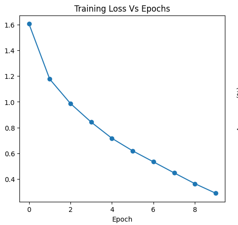
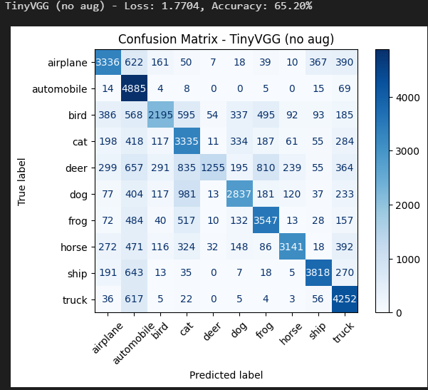
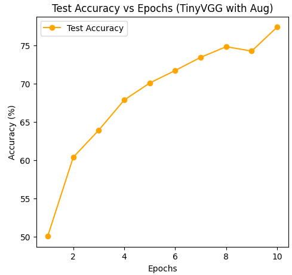
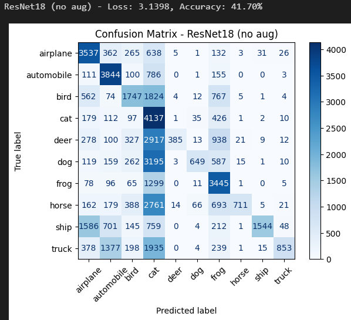
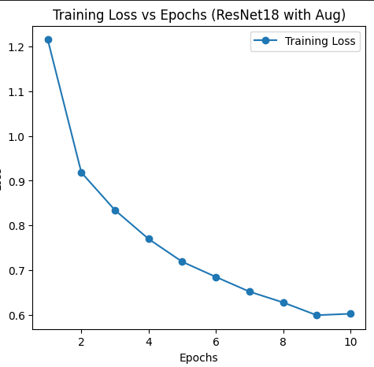
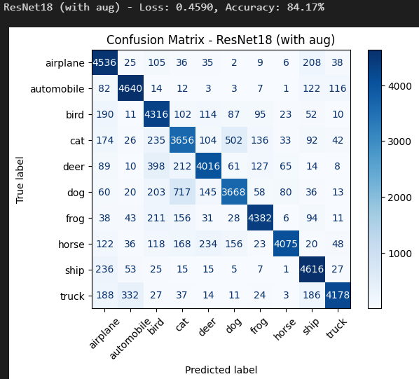

# CIFAR-10 Image Classification

This project implements image classification on the CIFAR-10 dataset using two approaches:
1. A custom CNN (TinyVGG) trained from scratch
2. A pretrained ResNet18 model (transfer learning)

Both models are evaluated with and without data augmentation. The results include training curves, test accuracy, and confusion matrices.

---

## Models and Training Setup

### 1. TinyVGG (Scratch)
- Input: 3-channel images (32x32)
- Hidden units: 32
- Output: 10 classes
- Optimizer: Adam (lr=0.001)
- Loss: CrossEntropyLoss
- Epochs: 10
- Batch size: **128** (may cause high memory usage on lower-end PCs/GPUs)

### 2. ResNet18 (Pretrained on ImageNet)
- Loaded from `torchvision.models`
- Final layer modified to output 10 classes instead of 1000
- Optimizer: Adam (lr=0.001)
- Loss: CrossEntropyLoss
- Epochs: 10
- Batch size: **128** (may cause high memory usage on lower-end PCs/GPUs)

---

## Results

### TinyVGG (No Augmentation)
- Final Accuracy: 75.13%
- Loss vs Epochs Curve  
  
- Accuracy vs Epochs Curve  
  
- Confusion Matrix  
  

---

### TinyVGG (With Augmentation)
- Final Accuracy: 77.38%
- Loss vs Epochs Curve  
  
- Accuracy vs Epochs Curve  
  
- Confusion Matrix  
  

---

### ResNet18 (No Augmentation)
- Final Accuracy: 50.80%
- Loss vs Epochs Curve  
  
- Accuracy vs Epochs Curve  
  
- Confusion Matrix  
  

---

### ResNet18 (With Augmentation)
- Final Accuracy: 84.17%
- Loss vs Epochs Curve  
  
- Accuracy vs Epochs Curve  
  
- Confusion Matrix  
  

---

## How to Run
1. Clone the repository:
   
   git clone https://github.com/Rishit-Agg/image-classifier-CIFAR10.git 
   cd image-classifier-CIFAR10

2. Install dependencies:

    pip install -r requirements.txt

3. Run the notebook (.ipynb) in Jupyter or VSCode to train and evaluate the models.

## Notes

- All experiments were run for 10 epochs.

- Training was performed on CIFAR-10 (60,000 images across 10 classes).

- Both training loss/accuracy curves and confusion matrices are provided for comparison.

- Also the accuracy can be increased with the increased number of epochs.

